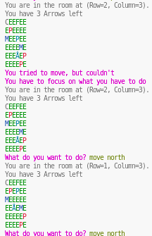

# The Fountain

A game to recreate "Hunt the Wumpus" in another flavor.
Press "help" in the terminal to see a guide.
Built with .NET 7

## How to play:

- Clone the repository
- Build the project
- Run the project

## View of game:

;

## Todos

- [x] Create the foundation.
- [x] Create three worlds based on size.
- [x] Create pits: Pits are bottomless holes in the ground. If you fall in, you die.
- [x] Create Maelstroms: Whirlpools that suck you in and spit you out in a random location.
- [x] Create Amaroks: Necrotizing masses of flesh that resemble carnivorous mammals, cursed to roam the caverns.
  - [x] Amaroks and Maelstorms need to be able to interact as well.
  - [x] Amaroks need to be able to fall into a pit.
- [x] Create Weapons: Weapons are used to incapacitate enemies for the whole duration.
  - [x] The only reasonable weapon in the game is a bow / arrow
  - [x] It should only be able to incapacitate one amarok at a time.
- [x] Create help menu.
- [x] Clean up the game and make the flow less confusing.

----
MIT Licensed.
Feedback always welcome 😄
